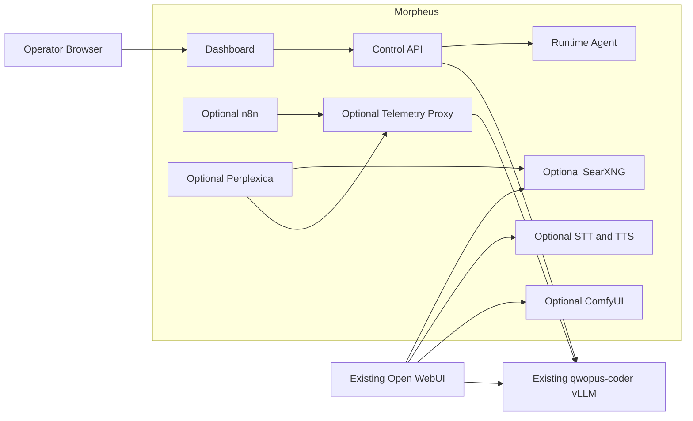

# Morpheus Architecture

Status: Proposed

Architecture version: 0.1

## 1. Architectural Objective

Morpheus adds an independently owned control plane and optional sidecars around
an existing OpenAI-compatible inference service. The architecture must preserve
the operational value of the current setup while preventing accidental control
of external containers, data, and GPU configuration.

The primary design is a ports-and-adapters system. Domain code defines health,
capability, ownership, policy, and lifecycle behavior. Infrastructure code
implements vLLM, Docker, NVIDIA, database, filesystem, and third-party service
adapters behind typed protocols.

## 2. System Context



ODS is intentionally absent from the context diagram. It is not a component,
dependency, deployment prerequisite, or control path.

## 3. Ownership Boundaries

### 3.1 Externally Owned

- the `ai` Compose project;
- `qwopus-coder` and its image, model revision, command, caches, and ports;
- the existing `open-webui` container and `/mnt/data/AI/open-webui` data;
- the `ai_default` Docker network;
- `/mnt/data/AI/docker-compose.yml`;
- GPU drivers, Docker Engine, NVIDIA runtime, and host firewall;
- model and Hugging Face caches.

External resources may be observed through public APIs or read-only adapters.
Their names must never be accepted as lifecycle targets.

### 3.2 Morpheus Owned

- source, configuration, secrets, migrations, and documentation in this repo;
- resources labeled `io.morpheus.project=<project-id>`;
- Morpheus containers, networks, volumes, databases, logs, and backups;
- optional third-party sidecars deployed by Morpheus;
- runtime-agent unit and credentials when the operator installs it;
- dashboard sessions and telemetry records.

### 3.3 Shared but Not Owned

Morpheus sidecars may attach to `ai_default` for Docker DNS connectivity. The
network is declared external and must never be created, modified, pruned, or
removed by Morpheus.

## 4. Repository Architecture

```text
src/morpheus/
  core/                 Pure domain models, policy, and use cases
  ports/                Protocols for external capabilities
  adapters/
    inference/          OpenAI and vLLM HTTP adapters
    metrics/            Prometheus and NVIDIA metric adapters
    runtime/            Agent client and Morpheus resource adapter
    persistence/        SQLite repositories and migrations
    services/           Search, voice, workflow, research adapters
  api/                  Versioned FastAPI transport
  agent/                Loopback runtime agent and allowlisted operations
  cli/                  Operator CLI and machine-readable output
  telemetry/            Optional OpenAI-compatible streaming proxy

web/
  src/
    api/                Generated or schema-checked API client
    components/         Reusable operational UI elements
    features/           Dashboard feature areas
    pages/              Route-level views
  tests/                Unit and component tests

deploy/
  compose.yaml          Core Morpheus services
  compose.*.yaml        Optional capability overlays
  config/               Versioned non-secret sidecar configuration
  systemd/              Optional user-level agent unit template

tests/
  unit/                 Pure and adapter-isolated tests
  contract/             Protocol, schema, and third-party API contracts
  integration/          Disposable service and persistence tests
  acceptance/           Requirement-level workflows
  e2e/                  Browser and deployed-stack tests
  live/                 Explicit read-only target-host validation
  fixtures/             Versioned sanitized responses and input files
```

## 5. Core Components

### 5.1 Domain Core

The core contains immutable or explicitly stateful domain models for:

- service identity and ownership;
- health state and evidence;
- model identity and capabilities;
- resource observations;
- feature availability and blockers;
- lifecycle requests and policy decisions;
- backup manifests and validation results;
- telemetry summaries and retention policy.

The core does not import FastAPI, SQLAlchemy, Docker, HTTP clients, subprocess,
or frontend concepts. Time, identifiers, and external results enter through
ports so tests remain deterministic.

### 5.2 Control API

The API is a Python 3.12 FastAPI application with a versioned `/api/v1` surface.
It coordinates domain use cases and adapters but has no Docker socket access.

Responsibilities:

- authentication and browser session management;
- validated configuration and safe public configuration;
- health and capability aggregation;
- dashboard queries;
- Morpheus-owned lifecycle requests through the runtime agent;
- backup, restore preflight, and support bundle coordination;
- audit events for state-changing actions.

The OpenAPI document is treated as a contract artifact. Breaking changes require
a new API version or documented migration period.

### 5.3 Runtime Agent

The runtime agent is a small host-native Python service bound to loopback for
host-native clients or to a Morpheus-owned Unix socket for the containerized
control API. The API mounts only the socket directory read-only; it never mounts
the Docker socket. Compose grants the API process only the installing user's
numeric group so the agent socket can remain group-read/write rather than
world-accessible. The agent runs as the installing user, not root, and
authenticates every request with a separate agent credential. Unix-socket file
permissions are not treated as authentication; the signed request remains
mandatory.

Its command surface is an explicit enum, not arbitrary shell input:

- read GPU summary;
- read memory, disk, and clock summary;
- inspect Morpheus-labeled container state;
- run Compose actions against the fixed Morpheus project directory;
- create a sanitized diagnostic snapshot;
- validate a proposed GPU workload transition.

The agent rejects:

- caller-supplied executable paths or shell fragments;
- Compose paths outside the configured deployment root;
- unlabeled or differently labeled resources;
- any target matching an external protected-resource inventory;
- destructive requests without a valid operation token and audit context.

Initial releases expose read-only operations only. Lifecycle methods are added
one at a time after their authorization and rollback tests exist.

### 5.4 Dashboard

The dashboard is a TypeScript application using React and a conventional build
tool. It is an operational interface, not a marketing site.

Design characteristics:

- dense, scan-friendly system status;
- stable layouts for changing metrics;
- restrained color with icon and text status indicators;
- no nested decorative cards;
- accessible tables, dialogs, tabs, toggles, and tooltips;
- explicit timestamps and evidence for health decisions;
- clear distinction between external read-only services and Morpheus-owned
  controllable services.

The frontend contains no authorization decision. It renders capabilities granted
by the API and handles denial as a normal state.

### 5.5 Telemetry Proxy

The optional proxy implements the minimum OpenAI-compatible endpoints required
by approved clients. It is not a general provider clone.

The streaming path forwards upstream bytes incrementally while a side channel
extracts safe timing and usage metadata. It does not concatenate or persist the
response body for observability.

Recorded fields include:

- generated request and trace IDs;
- start, first-byte, first-content-token, and completion timestamps;
- model requested and model reported;
- prompt, completion, cached, and speculative token counts when available;
- HTTP status, finish reason, cancellation, and normalized error class;
- client identity represented by a non-secret stable ID.

### 5.6 Persistence

SQLite is the initial control-plane database because the target is one host and
the write volume is modest. It uses WAL mode, bounded busy timeouts, foreign
keys, transactional migrations, and explicit retention jobs.

Database content:

- schema and migration version;
- feature configuration excluding secret values;
- health history with bounded retention;
- telemetry metadata with bounded retention;
- audit events;
- backup and restore manifests.

Prompts, responses, uploaded documents, audio, images, API keys, and session
signing secrets are excluded unless a future specification adds an explicit,
off-by-default retention feature.

## 6. Health Model

Health is a state with evidence, not a Boolean:

```text
unknown -> starting -> ready
    |          |         |
    v          v         v
unreachable  degraded  incompatible
```

Every observation includes:

- state;
- stable reason code;
- safe summary;
- observed timestamp;
- probe duration;
- evidence source;
- optional next action;
- expiry time after which the result becomes stale.

Aggregation rules are pure domain logic. A child failure may degrade a feature
without marking unrelated capabilities unavailable.

## 7. Network Architecture

Morpheus uses two networks:

1. `morpheus_internal`, owned by Morpheus, for control-plane and sidecar traffic.
2. `ai_default`, external and not owned, only for services that must reach
   `qwopus-coder` or be reached by Open WebUI through Docker DNS.

Default host bindings:

| Surface | Default | Exposure |
|---|---:|---|
| Control API | `127.0.0.1:7400` | Host only |
| Dashboard | `127.0.0.1:7401` | Host only |
| Runtime agent | `127.0.0.1:7402` | Host only |
| Sidecar APIs | none | Docker networks only |

Browser-facing optional services receive loopback ports only when their own UI
cannot be proxied safely through the dashboard.

LAN mode is a separate architecture decision requiring authentication, origin
policy, TLS or an explicitly accepted trusted-LAN posture, and network exposure
tests. It is not implemented by changing a single bind-address default.

## 8. Configuration Architecture

Configuration precedence, highest first:

1. explicit CLI argument for the current invocation;
2. environment variable;
3. ignored `.env` file;
4. versioned non-secret configuration file;
5. documented default.

Configuration is divided into:

- bootstrap settings needed before database access;
- public settings safe for dashboard display;
- secret references;
- runtime-discovered facts that cannot be configured;
- operator preferences stored transactionally.

Runtime-discovered facts never silently overwrite operator configuration. A
mismatch produces a diagnostic with both values and their sources.

## 9. Dependency and Container Policy

- Prefer stable upstream projects with documented APIs and health behavior.
- Use upstream images, not ODS-produced images.
- Validate a version tag, then record the immutable image digest.
- Keep a lock manifest containing source URL, version, digest, license, purpose,
  update owner, and last validation evidence.
- Build a Morpheus image only when configuration cannot be supplied through a
  documented upstream extension point.
- Do not execute remote install scripts through a shell.
- Generate an SBOM and scan application and container dependencies for release.

## 10. Error and Logging Model

External errors are normalized into stable categories:

- configuration;
- authentication or authorization;
- dependency unavailable;
- dependency incompatible;
- resource constrained;
- timeout or cancellation;
- persistence;
- conflict;
- internal.

API errors contain a request ID, stable code, safe message, and optional safe
remediation. Internal exception details stay in protected logs.

Logs are structured JSON in deployed mode and human-readable in development.
Redaction occurs before formatting. Sensitive keys and authorization headers
are rejected from log context rather than masked after serialization.

## 11. Deployment and Upgrade

The deployment is a Morpheus Compose project plus an optional user-level runtime
agent. Installation does not install Docker, GPU drivers, or system packages.

Upgrade sequence:

1. validate configuration, disk space, dependency locks, and external runtime;
2. create a Morpheus-only backup;
3. pull or build pinned artifacts;
4. run database migration preflight;
5. replace Morpheus services with bounded health waits;
6. run behavioral smoke tests;
7. compare protected external runtime identity and health with the pre-state;
8. commit the upgrade marker or roll back Morpheus artifacts and database.

Uninstall stops and removes only labeled Morpheus resources. Data preservation
is the default. The external network is disconnected but never removed.

## 12. Key Decisions

- [ADR-0001: Independent sidecar control plane](adr/0001-independent-sidecar-control-plane.md)
- [ADR-0002: No Docker socket in web services](adr/0002-no-docker-socket-in-web-services.md)
- [ADR-0003: React dashboard and signed browser session](adr/0003-frontend-and-browser-authentication.md)
- [ADR-0004: Defer LiteLLM and independent RAG](adr/0004-gateway-and-rag-decision.md)

Additional decisions required before implementation reaches them:

- Python packaging and migration libraries;
- telemetry database retention defaults;
- GPU transition mechanism for image generation;
