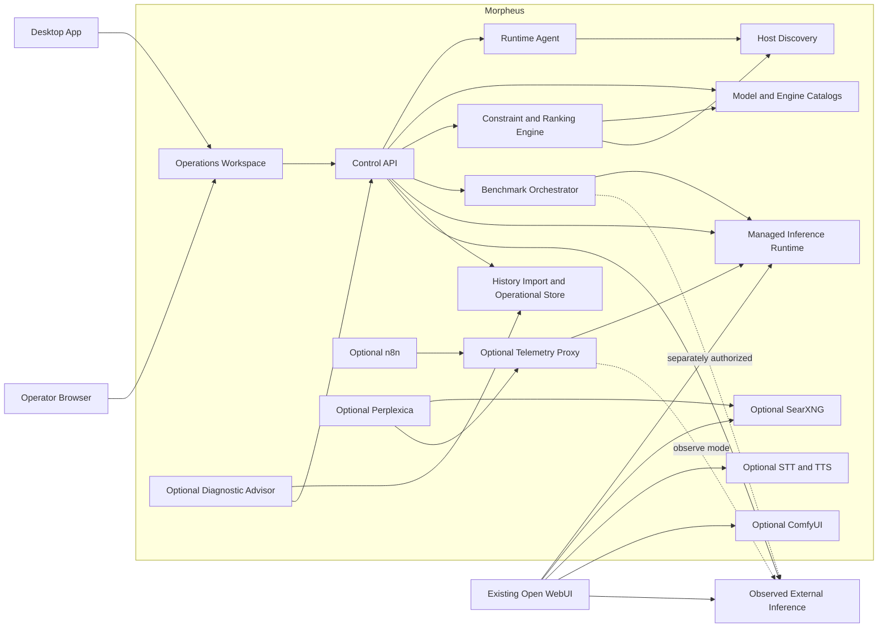

# Morpheus Architecture

Status: Accepted v0.2 target architecture; implementation is under
rectification; v0.1 observe-mode deployment remains active

Architecture version: 0.2

Conformance status is recorded in
[`RECTIFICATION_PLAN.md`](RECTIFICATION_PLAN.md). During rectification this
document remains the target: do not preserve a competing implementation model
by editing the architecture to match it without the change-control process in
the implementation plan.

## 1. Architectural Objective

Morpheus is a focused developer-inference control plane. It can observe an
existing OpenAI-compatible service without owning it or manage a separately
owned model, engine, endpoint, benchmark history, and operational lifecycle.
The architecture must preserve the deployed v0.1 value while making discovery,
selection, installation, benchmarking, serving, and diagnosis one coherent and
reversible product.

The primary design is a ports-and-adapters system. Domain code defines health,
capability, ownership, policy, and lifecycle behavior. Infrastructure code
implements platform-native host, process, service, filesystem, telemetry,
engine, database, and third-party adapters behind typed protocols. Docker,
vLLM, and NVIDIA are supported adapters, not universal architecture boundaries.

## 2. System Context



ODS is intentionally absent from the context diagram. It is not a component,
dependency, deployment prerequisite, or control path.

External developer-harness qualification tools are also outside the Morpheus
component boundary. They may call a served endpoint like any other authorized
client and may later export sanitized task evidence for explicit import, but
Morpheus does not install, configure, start, or require them. This optional
relationship is defined by
[ADR-0010](adr/0010-optional-external-harness-qualification-evidence.md), not by
a runtime edge in the system context.

## 3. Ownership Boundaries

### 3.1 Externally Owned

- the `ai` Compose project;
- `coder-model` and its image, model revision, command, caches, and ports;
- the existing `open-webui` container and `/mnt/data/AI/open-webui` data;
- the `ai_default` Docker network;
- `/mnt/data/AI/docker-compose.yml`;
- GPU drivers, Docker Engine, NVIDIA runtime, and host firewall;
- model and Hugging Face caches.
- developer-facing harness binaries, their configuration/credentials, task
  workspaces, and independent qualification tools such as Tonos.

External resources may be observed through public APIs or read-only adapters.
Their names must never be accepted as lifecycle targets.

### 3.2 Morpheus Owned

- source, configuration, secrets, migrations, and documentation in this repo;
- resources labeled `io.morpheus.project=<project-id>`;
- Morpheus containers, networks, volumes, databases, logs, and backups;
- optional third-party sidecars deployed by Morpheus;
- runtime-agent unit and credentials when the operator installs it;
- dashboard sessions and telemetry records.
- machine-profile snapshots and versioned catalogs;
- managed model artifacts, engine artifacts, rendered launch plans, and caches
  below configured owned roots;
- managed inference containers, endpoints, benchmark campaigns, raw observations,
  normalized summaries, comparisons, and recommendation records;
- approved redacted log/event history and diagnostic evidence packages.

### 3.3 Shared but Not Owned

Morpheus sidecars may attach to `ai_default` for Docker DNS connectivity. The
network is declared external and must never be created, modified, pruned, or
removed by Morpheus.

### 3.4 Ownership Modes

An inference identity contains exactly one immutable ownership mode:

- `external_observed`: read-only health, model, metrics, and explicitly
  authorized benchmark access;
- `morpheus_managed`: lifecycle and configuration through one exact owned
  deployment manifest;

An adoption candidate is a separate workflow-scoped transfer record that binds
one exact `external_observed` identity, its captured pre-state, one proposed
`morpheus_managed` identity, confirmation, and recovery plan. It is not a third
ownership mode and cannot be supplied to ordinary lifecycle operations.

Successful discovery, endpoint configuration, matching names, or shared network
membership cannot change the mode. Adoption commits the new identity only after
preflight, confirmation, smoke and benchmark gates, and recovery evidence.

## 4. Repository Architecture

```text
src/morpheus/
  core/                 Pure domain models, policy, and use cases
  ports/                Protocols for external capabilities
  adapters/
    inference/          OpenAI and vLLM HTTP adapters
    metrics/            Prometheus and NVIDIA metric adapters
    runtime/            Agent client, lifecycle, and labeled resource observers
    persistence/        SQLite repositories and migrations
    services/           Search, voice, workflow, research adapters
  api/                  Versioned FastAPI transport
  agent/                Loopback runtime agent and allowlisted operations
  cli/                  Operator CLI and machine-readable output
  telemetry/            Optional OpenAI-compatible streaming proxy

web/
  src/
    api/                Generated or schema-checked API client
    components/         Reusable operational UI elements
    features/           Dashboard feature areas
    pages/              Route-level views
  tests/                Unit and component tests
  e2e/                  Cross-browser accessibility and responsive workflows

desktop/
  src-tauri/             Minimal Tauri shell, capabilities, and packaging
  tests/                 Desktop bootstrap and backend compatibility workflows

validation/
  browser/              Pinned internal-only Playwright gate
  load/                 Fixed k6, resource, qualification, and soak profiles
  security/             Offline scans, SBOMs, and closed evidence verification

deploy/
  compose.yaml          Core Morpheus services
  compose.*.yaml        Optional capability overlays
  config/               Versioned non-secret sidecar configuration
  linux/                systemd-user units and Linux package definitions
  windows/              Per-user background registration and package definitions
  macos/                LaunchAgent and package/trust definitions

tests/
  unit/                 Pure and adapter-isolated tests
  contract/             Protocol, schema, and third-party API contracts
  integration/          Disposable service and persistence tests
  acceptance/           Requirement-level workflows
  e2e/                  Browser and deployed-stack tests
  live/                 Explicit read-only target-host validation
  fixtures/             Versioned sanitized responses and input files
```

## 5. Core Components

### 5.1 Domain Core

The core contains immutable or explicitly stateful domain models for:

- service identity and ownership;
- health state and evidence;
- model identity and capabilities;
- resource observations;
- feature availability and blockers;
- lifecycle requests and policy decisions;
- backup manifests and validation results;
- telemetry summaries and retention policy.

The core does not import FastAPI, SQLAlchemy, Docker, HTTP clients, subprocess,
or frontend concepts. Time, identifiers, and external results enter through
ports so tests remain deterministic.

### 5.2 Control API

The API is a Python 3.12 FastAPI application with a versioned `/api/v1` surface.
It coordinates domain use cases and adapters but has no Docker socket access.

Responsibilities:

- authentication and browser session management;
- validated configuration and safe public configuration;
- health and capability aggregation;
- dashboard queries;
- Morpheus-owned lifecycle requests through the runtime agent;
- desktop/backend compatibility handshake and bounded bootstrap/update plans;
- backup, restore preflight, and support bundle coordination;
- audit events for state-changing actions.

The OpenAPI document is treated as a contract artifact. Breaking changes require
a new API version or documented migration period.

The authenticated `GET /api/v1/system/compatibility` endpoint is the desktop
bootstrap boundary. Given `X-Morpheus-Desktop-Version`, it returns the API and
backend versions, supported desktop range, OS/architecture, enabled adapter
identities and support tiers, supported operations, and compatibility state. It
does not install, update, or mutate anything; incompatible or missing local
state is resolved through a separate confirmed native package plan.

### 5.3 Runtime Agent

The runtime agent is a small target-native backend service bound to loopback.
Linux deployments may additionally use a Morpheus-owned Unix socket for a
containerized control API; Windows and macOS do not depend on that transport.
The API never receives a Docker socket. The agent runs as the installing user,
not root, and authenticates every request with a separate agent credential.
Transport permissions are defense in depth and are never treated as
authentication; signed requests remain mandatory on every platform.

Its command surface is an explicit enum, not arbitrary shell input. Portable
operations dispatch through typed ports for host discovery, process supervision,
service management, filesystem ownership, secrets, hardware telemetry, and
managed engines. Platform adapters use systemd and Unix process groups on
Linux, Windows per-user registration and Job Objects, and LaunchAgent and Unix
process groups on macOS.

Allowed capabilities include:

- read GPU summary;
- read memory, disk, and clock summary;
- inspect exact Morpheus-owned native processes or labeled container state;
- run a bounded native-engine or Compose lifecycle plan against its fixed owned
  deployment root;
- create a sanitized diagnostic snapshot;
- validate a proposed GPU workload transition.

The agent rejects:

- caller-supplied executable paths or shell fragments;
- lifecycle paths outside the configured owned deployment root;
- unlabeled or differently labeled resources;
- any target matching an external protected-resource inventory;
- destructive requests without a valid operation token and audit context.

The runtime agent is read-only unless the fixed lifecycle deployment root is
explicitly enabled. Lifecycle methods use a separate signed endpoint and accept
only bounded release or backup identifiers; they never accept resource names,
commands, shell input, or Compose paths.

### 5.4 Operations Application

The operations application is strict TypeScript and React shared by two delivery
surfaces: a Tauri 2 desktop shell and the backend's loopback browser
application. Both consume the same versioned API and authorization decisions.
The Tauri shell exposes only narrowly allowlisted application/bootstrap
capabilities and gives the webview no general shell or filesystem access. It is
an operational interface, not a marketing site.

Design characteristics:

- dense, scan-friendly system status;
- stable layouts for changing metrics;
- restrained color with icon and text status indicators;
- no nested decorative cards;
- accessible tables, dialogs, tabs, toggles, and tooltips;
- explicit timestamps and evidence for health decisions;
- clear distinction between external read-only services and Morpheus-owned
  controllable services.

The frontend contains no authorization decision. It renders capabilities granted
by the API and handles denial as a normal state.

### 5.5 Telemetry Proxy

The optional proxy implements the minimum OpenAI-compatible endpoints required
by approved clients. It is not a general provider clone.

The streaming path forwards upstream bytes incrementally while a side channel
extracts safe timing and usage metadata. It does not concatenate or persist the
response body for observability.

Recorded fields include:

- generated request and trace IDs;
- start, first-byte, first-content-token, and completion timestamps;
- model requested and model reported;
- prompt, completion, cached, and speculative token counts when available;
- HTTP status, finish reason, cancellation, and normalized error class;
- client identity represented by a non-secret stable ID.

### 5.6 Persistence

SQLite is the initial control-plane database because the target is one host and
the write volume is modest. It uses WAL mode, bounded busy timeouts, foreign
keys, transactional migrations, and explicit retention jobs.

Database content:

- schema and migration version;
- feature configuration excluding secret values;
- health history with bounded retention;
- telemetry metadata with bounded retention;
- audit events;
- backup and restore manifests.

Prompts, responses, uploaded documents, audio, images, API keys, and session
signing secrets are excluded unless a future specification adds an explicit,
off-by-default retention feature.

## 6. Health Model

Health is a state with evidence, not a Boolean:

```text
unknown -> starting -> ready
    |          |         |
    v          v         v
unreachable  degraded  incompatible
```

Every observation includes:

- state;
- stable reason code;
- safe summary;
- observed timestamp;
- probe duration;
- evidence source;
- optional next action;
- expiry time after which the result becomes stale.

Aggregation rules are pure domain logic. A child failure may degrade a feature
without marking unrelated capabilities unavailable.

## 7. Network Architecture

Morpheus uses two networks:

1. `morpheus_internal`, owned by Morpheus, for control-plane and sidecar traffic.
2. `ai_default`, external and not owned, only for services that must reach
   `coder-model` or be reached by Open WebUI through Docker DNS.

Default host bindings:

| Surface | Default | Exposure |
|---|---:|---|
| Control API | `127.0.0.1:7400` | Host only |
| Dashboard | `127.0.0.1:7401` | Host only |
| Runtime agent | `127.0.0.1:7402` | Host only |
| Sidecar APIs | none | Docker networks only |

Browser-facing optional services receive loopback ports only when their own UI
cannot be proxied safely through the dashboard.

LAN mode is a separate architecture decision requiring authentication, origin
policy, TLS or an explicitly accepted trusted-LAN posture, and network exposure
tests. It is not implemented by changing a single bind-address default.

## 8. Configuration Architecture

Configuration precedence, highest first:

1. explicit CLI argument for the current invocation;
2. environment variable;
3. ignored `.env` file;
4. versioned non-secret configuration file;
5. documented default.

Configuration is divided into:

- bootstrap settings needed before database access;
- public settings safe for dashboard display;
- secret references;
- runtime-discovered facts that cannot be configured;
- operator preferences stored transactionally.

Runtime-discovered facts never silently overwrite operator configuration. A
mismatch produces a diagnostic with both values and their sources.

## 9. Dependency and Container Policy

- Prefer stable upstream projects with documented APIs and health behavior.
- Use upstream images, not ODS-produced images.
- Validate a version tag, then record the immutable image digest.
- Keep a lock manifest containing source URL, version, digest, license, purpose,
  update owner, and last validation evidence.
- Build a Morpheus image only when configuration cannot be supplied through a
  documented upstream extension point.
- Do not execute remote install scripts through a shell.
- Generate an SBOM and scan application and container dependencies for release.

## 10. Error and Logging Model

External errors are normalized into stable categories:

- configuration;
- authentication or authorization;
- dependency unavailable;
- dependency incompatible;
- resource constrained;
- timeout or cancellation;
- persistence;
- conflict;
- internal.

API errors contain a request ID, stable code, safe message, and optional safe
remediation. Internal exception details stay in protected logs.

Logs are structured JSON in deployed mode and human-readable in development.
Redaction occurs before formatting. Sensitive keys and authorization headers
are rejected from log context rather than masked after serialization.

## 11. Deployment and Upgrade

The default workstation deployment is a checksummed desktop package plus a
separately versioned target-native backend installed as a per-user background
service. Developer/source-qualified packages may be unsigned; their manifest
states that status, installation requires explicit local confirmation, and
unattended update remains disabled. Signed-distribution qualification is an
optional final lane when platform credentials are available. Linux uses
systemd-user, Windows uses per-user background registration, and macOS uses
LaunchAgent. Backend-only installation remains available for headless hosts.
Compose is retained as a Linux runtime adapter, not a platform prerequisite.
Installation does not install GPU drivers or silently enable host
virtualization/container prerequisites.

Upgrade sequence:

1. validate configuration, disk space, dependency locks, and external runtime;
2. create a Morpheus-only backup;
3. acquire target-native artifacts verified under the active package trust
   policy;
4. run database migration preflight;
5. replace the backend, desktop, or managed runtime with bounded health waits;
6. run behavioral smoke tests;
7. compare protected external runtime identity and health with the pre-state;
8. commit the upgrade marker or roll back Morpheus artifacts and database.

Uninstall stops and removes only exact Morpheus-owned services, processes,
packages, and labeled resources. Data preservation is the default. Any external
network is disconnected but never removed. Desktop removal and backend removal
are separate explicit choices.

## 12. v0.2 Selection and Planning Plane

The selection plane is pure domain logic over versioned inputs:

```text
machine profile
  + model catalog
  + engine catalog
  + operator policy
  + developer workload profile
  + comparable benchmark evidence
  -> viable deployment plans
  -> ranked recommendations
```

A deployment plan identifies the model revision and artifact digest,
quantization/format, engine artifact, rendered engine settings, served aliases,
context, concurrency, cache policy, memory and disk estimates, owned paths,
ports, health contract, benchmark gate, rollback target, and source evidence.
Plans are immutable. Changing any input creates a new plan identity rather than
silently editing the active record.

Hard constraints and ranking are separate. Hard constraints cover platform and
engine support, memory/storage capacity and safety margin, required API features,
license/trust policy, and operator limits. Ranking uses declared weights only
after a tuple is viable. Estimated, measured, stale, and missing evidence remain
distinct throughout the calculation and UI.

Catalog refresh is an authenticated administrative operation. Catalog inputs are
schema-validated, source-attributed, checksummed, and retained by version so an
old recommendation is reproducible. A catalog is not executable configuration
and cannot contain shell fragments, arbitrary container arguments, or secret
values.

## 13. Managed Runtime and Engine Adapters

Each supported engine implements one typed adapter contract:

- platform and accelerator compatibility;
- model format, quantization, context, tool, structured-output, and streaming
  support;
- deterministic launch-plan rendering from bounded typed settings;
- artifact/cache preflight and disk reservation;
- start, behavioral health, metrics, approved log/event stream, and graceful
  stop;
- cancellation, cleanup, upgrade, rollback, and exact identity reporting.

The adapter never accepts an arbitrary command or free-form engine flag from a
UI request. New engine settings first become typed configuration fields with
validation and compatibility tests. Native `llama.cpp`/`llama-server` with
verified GGUF artifacts is the common stable engine path on Ubuntu x86-64,
Windows x86-64, and Apple Silicon macOS. Linux NVIDIA additionally qualifies
vLLM. Ollama is optional; Windows vLLM through WSL2 and Apple
vLLM-Metal/MLX begin as experimental. Docker Compose is one Linux adapter and
cannot establish Windows or macOS support.

Acquisition/staging, benchmark, promotion, rollback, and adoption are separate
immutable state machines. Their records share exact plan and artifact
identities, but a transition in one machine never implies a transition in
another:

| Machine | Allowed non-terminal transitions | Terminal states |
|---|---|---|
| acquisition/staging | `planned -> acquiring|cancelled`; `acquiring -> verified|cancelled|failed`; `verified -> staged|failed` | `staged`, `cancelled`, `failed` |
| benchmark campaign | `planned -> authorized|cancelled`; `authorized -> running|cancelled`; `running -> succeeded|cancelled|aborted|failed` | `succeeded`, `cancelled`, `aborted`, `failed` |
| promotion | `proposed -> preflighted|rejected`; `preflighted -> confirmed|rejected`; `confirmed -> activating`; `activating -> active|recovering`; `recovering -> rolled_back|failed` | `active`, `rejected`, `rolled_back`, `failed` |
| rollback | `requested -> preflighted|rejected`; `preflighted -> restoring|rejected`; `restoring -> verified|failed`; `verified -> completed|failed` | `completed`, `rejected`, `failed` |
| adoption | `proposed -> pre_state_captured|rejected`; `pre_state_captured -> preflighted|rejected`; `preflighted -> confirmed|rejected`; `confirmed -> transferring`; `transferring -> validating|restoring`; `validating -> adopted|restoring`; `restoring -> restored|failed` | `adopted`, `rejected`, `restored`, `failed` |

Success in acquisition or benchmark only supplies evidence to a later machine.
Promotion and adoption each require their own confirmation. Adoption is the only
machine allowed to propose an ownership transfer. The captured external identity
record always remains immutable and `external_observed`; when adoption reaches
`adopted`, its separately proposed `morpheus_managed` identity becomes the
current managed target.
Terminal records never transition again. Failures not listed above leave the
current durable record unchanged and produce a separate error/audit result;
adapters cannot invent a transition to make cleanup convenient.

Only one full-GPU runtime or benchmark candidate may own an exclusive device at
a time unless the machine profile and adapter evidence explicitly support safe
partitioning. The orchestrator records durable checkpoints before every
state-changing edge.

## 14. Benchmark and Analytics Data Plane

Benchmark storage is not an unstructured artifacts directory. It has versioned
entities for:

- machine profiles and volatile pre/post observations;
- model, engine, deployment-plan, and benchmark-suite identities;
- campaign intents, authorization, workload parameters, samples, failures, and
  cancellation;
- normalized summaries, dispersion, comparability decisions, regressions, and
  recommendation calibration;
- imported legacy evidence with source path, checksum, mapping version, and
  explicit missing provenance.

Raw result payloads are immutable. Derived summaries can be regenerated and
carry their reducer version. Comparison requires compatible workload, suite,
model feature, engine/configuration, warm-up/cache, and machine dimensions;
otherwise the result is labeled normalized, estimated, or incomparable.

### 14.1 Optional External Harness Evidence

Morpheus remains independently qualifiable through its direct-provider
benchmark suite. A separately operated harness lab may export sanitized
client-observed correctness, tool-use, agentic, edit/verification, failure, and
end-to-end timing evidence. Import is an explicit administrative action through
a versioned parser; there is no runtime source/package dependency or callback.

The import boundary records producer/schema/redactor versions, source digest,
harness and effective configuration, provider/model observation, task/evaluator
identity, sample/dispersion data, limitations, content omissions, and mapping
version. It rejects secrets, raw conversation/reasoning content, arbitrary
commands, repository content, engine-control instructions, unknown future
schemas, and oversized documents. Parsed evidence remains attributed and
ineligible for ranking until canonical machine, deployment, suite, freshness,
and comparability policy permits it.

An optional external correlation value may appear as bounded untrusted search
metadata on both independently produced records. It is never substituted for a
Morpheus machine, model, deployment-plan, operation, campaign, request,
ownership, authentication, or authorization identity, and it does not establish
clock alignment. Its absence has no behavioral effect. A carrier is deferred to
a later versioned contract and must not use prompt content.

SQLite remains suitable for a single-machine initial release, with large raw
artifacts stored below an owned content-addressed results root and referenced by
checksum. Export bundles allow results from supported machines and operating
systems to be reviewed together without introducing a fleet controller.

Operational time series use bounded rollups and retention. Request content is
not stored. Morpheus metrics, deployment events, approved logs, benchmark
campaigns, and configuration changes share canonical internal correlation and
deployment-plan identifiers so the UI can explain before/after changes. An
optional external correlation value remains a separate untrusted metadata
field.

## 15. Operations Workspace and Diagnosis

The shared React application evolves from two tabs into a focused operator
workspace delivered through Tauri or the loopback browser:

```text
Overview
Hardware
Models
Engines
Runtime
Benchmarks
Analytics
Logs & Events
Diagnostics
Settings
Recovery
```

Routes consume versioned read/query models rather than raw engine output. Live
views receive bounded polling or event updates, historical views use paginated
and time-bounded queries, and every observation carries units, freshness, source,
and missing-data semantics. Settings are generated from typed schemas but
high-impact changes always become previewable deployment plans.

The diagnostic advisor is behind a provider port. Providers may be disabled,
local, or remote. The advisor receives a redacted evidence package, never raw
host access, and returns structured observations, hypotheses, confidence,
citations, missing evidence, and proposed typed checks. Its output cannot call
the runtime agent or lifecycle adapter. Any proposed state change re-enters the
normal plan, policy, preflight, and confirmation path.

## 16. Target and Access Architecture

Stable v0.2 targets Ubuntu 26.04 LTS x86-64, Windows 11 x86-64, and macOS 14 or
later on Apple Silicon. ubuntu-1 and ubuntu-2 are separate named Linux profiles,
not special-case branches. The same contracts discover each host and select
platform, telemetry, process, service, filesystem, secret, and engine adapters
through capabilities. Unsupported or inaccessible evidence degrades honestly
and is never represented as zero.

Loopback API/application binding remains the local default. The desktop can
connect locally or to a backend through an operator-established SSH tunnel; it
does not manage SSH credentials or silently open tunnels in v0.2. Direct network
access is a separate deployment profile with TLS termination, trusted identity
or strong local credentials, origin policy, proxy-header trust, rate limits,
session revocation, and exposure validation. No surface binds broadly because a
discovery result or convenience setting requested it.

## 17. Key Decisions

- [ADR-0001: Independent sidecar control plane](adr/0001-independent-sidecar-control-plane.md)
- [ADR-0002: No Docker socket in web services](adr/0002-no-docker-socket-in-web-services.md)
- [ADR-0003: React dashboard and signed browser session](adr/0003-frontend-and-browser-authentication.md)
- [ADR-0004: Defer LiteLLM and independent RAG](adr/0004-gateway-and-rag-decision.md)
- [ADR-0005: Dual-mode focused inference appliance](adr/0005-dual-mode-focused-inference-appliance.md)
- [ADR-0006: Evidence-ranked model and engine selection](adr/0006-evidence-ranked-model-engine-selection.md)
- [ADR-0007: Tauri desktop and independent backend](adr/0007-tauri-desktop-and-independent-backend.md)
- [ADR-0008: Tiered cross-platform runtime support](adr/0008-tiered-cross-platform-runtime-support.md)
- [ADR-0009: Dev-first packages and optional distribution signing](adr/0009-dev-first-packages-and-optional-distribution-signing.md)
- [ADR-0010: Optional external harness qualification evidence](adr/0010-optional-external-harness-qualification-evidence.md)

Open decisions that must be resolved or explicitly accepted before their
affected rectification requirement returns to `implemented`:

- database migration library;
- telemetry database retention defaults;
- managed model-cache quota and eviction defaults;
- benchmark history and operational time-series retention defaults;
- direct network access TLS and identity profile;
- GPU transition mechanism for legacy image generation if that scope reopens;

Existing code choices do not silently settle these decisions. Record a new ADR
when a choice changes a persistent format, security profile, retention policy,
or accepted scope boundary.
